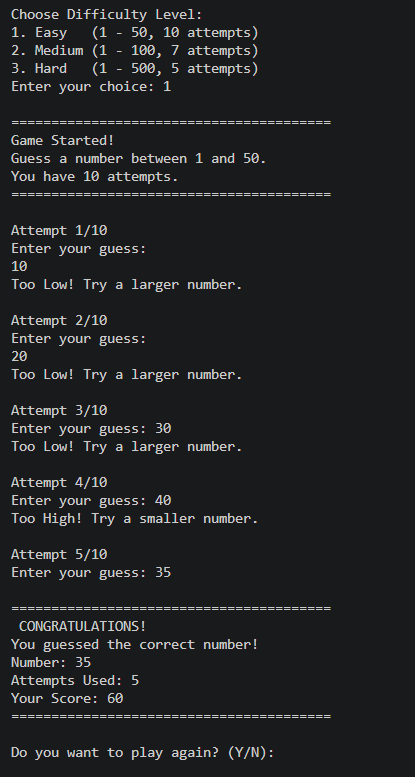

# 🎯 Guess Number Game in C

A simple and interactive **Number Guessing Game developed in C**.

## 📌 Features

- 🎲 Generates a random number
- 🎯 Allows the player to guess the number
- ⬆️ Shows "Too High" when the guess is too large
- ⬇️ Shows "Too Low" when the guess is too small
- 🔢 Counts the number of attempts
- 🏆 Displays the result when the correct number is guessed

## 🛠️ Technologies Used

- C Programming Language
- GCC Compiler
- Command Line Interface

## 🎮 How to Play

1. Run the program.
2. The computer generates a random number.
3. Enter your guess.
4. Follow the hints provided by the program.
5. Continue guessing until you find the correct number.
6. Try to guess the number in the minimum attempts!

## 📸 Game Screenshot

## 💻 Sample Output

```text
================================
       GUESS NUMBER GAME
================================

Enter your guess: 50
Too High! Try again.

Enter your guess: 25
Too Low! Try again.

Enter your guess: 37
Congratulations! You guessed the correct number.

Number of Attempts: 3
